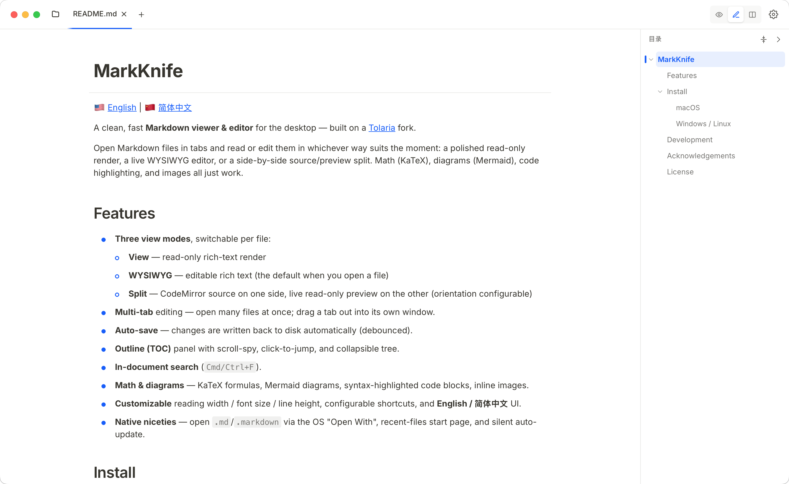

# MarkKnife

🇺🇸 [English](README.md) | 🇨🇳 [简体中文](README.zh-CN.md)

一个简洁、快速的桌面端 **Markdown 查看 / 编辑应用** —— 基于开源项目 [Tolaria](https://github.com/refactoringhq/tolaria) 二次开发。

支持以多标签打开 Markdown 文件,并按需切换查看方式:精致的只读渲染、所见即所得编辑、或左右分栏的「源码 + 预览」。数学公式(KaTeX)、图表(Mermaid)、代码高亮与图片均开箱即用。

<p>
  
</p>

## 功能特性

- **三种查看模式**,每个文件可单独切换:
  - **查看** —— 只读富文本渲染
  - **所见即所得** —— 可编辑富文本(打开文件时的默认模式)
  - **分栏** —— 一侧 CodeMirror 源码,另一侧实时只读预览(方向可在设置中调整)
- **多标签** 编辑 —— 同时打开多个文件;可将标签拖出为独立窗口。
- **自动保存** —— 改动防抖后自动写回磁盘。
- **目录(TOC)面板** —— 滚动高亮、点击跳转、树形折叠。
- **文档内查找**(`Cmd/Ctrl+F`)。
- **数学与图表** —— KaTeX 公式、Mermaid 图表、带语法高亮的代码块、内联图片。
- **可定制** —— 阅读宽度 / 字号 / 行高、可自定义快捷键,界面支持 **简体中文 / English**。
- **原生体验** —— 通过系统「打开方式」打开 `.md`/`.markdown`、最近文件起始页、静默自动更新。

## 安装

从 **[发布页](https://github.com/jaaksi/markknife/releases/latest)** 下载对应平台的最新版本。

### macOS

打开 `.dmg`,把 **MarkKnife** 拖到「应用程序」文件夹。

本应用**未经 Apple 公证**(项目没有 Apple 开发者账号),首次打开会被 macOS Gatekeeper 拦截(提示「已损坏」或「来自身份不明的开发者」)。按任一方式放行即可,之后正常使用、自动更新不受影响:

- **右键** App →「打开」,在弹窗里再点「打开」;
- 新系统(Sequoia 15+):双击被拦后,到 **系统设置 → 隐私与安全性**,点最下方「仍要打开」;
- 或在终端执行:`xattr -dr com.apple.quarantine /Applications/MarkKnife.app`

### Windows

从发布页获取安装包(`.msi`/`.exe`)并运行。

## 开发

```bash
pnpm install
pnpm dev         # 浏览器开发(走内置 Tauri mock,无原生能力)
pnpm tauri dev   # 原生应用开发
pnpm build       # tsc -b && vite build
pnpm lint        # eslint(必须 0 警告)
pnpm tauri build # 打包构建(.dmg 等)
```

技术栈:**Tauri 2(Rust)+ React 19 + TypeScript + Vite + Tailwind v4 + shadcn/ui**,富文本用 **BlockNote**,源码编辑用 **CodeMirror 6**,数学公式 **KaTeX**,图表 **Mermaid**。

> 想参与开发?架构概览与约定见 [CLAUDE.md](CLAUDE.md)。

## 致谢

基于 Luca Ronin 的开源项目 **Tolaria**(MIT)精简改造而成,感谢原项目。

## 许可证

[AGPL-3.0-or-later](LICENSE)。
